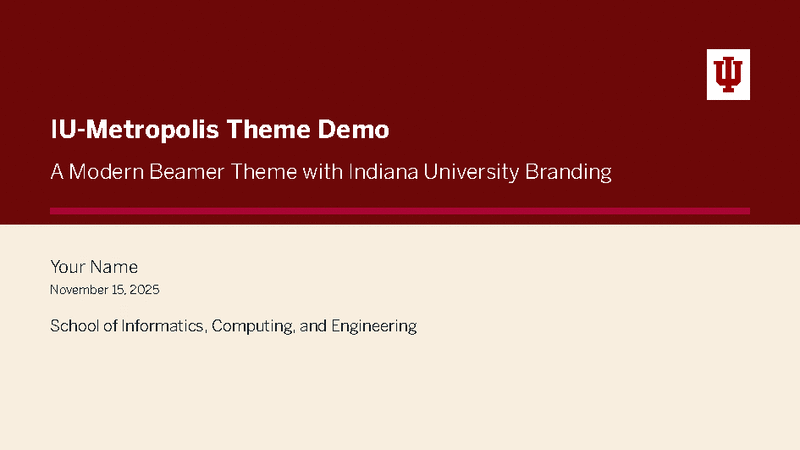

# IU-Metropolis Beamer Theme

A modern, professional Beamer presentation theme combining the clean design of Metropolis with Indiana University's official branding.



## Features

- **Official IU Branding**: Uses IU's official colors (#A90533 Crimson, #111B23 Black)
- **IU Typography**: Benton Sans (primary), Georgia Pro (secondary), Azeret Mono (tertiary)
- **Clean Modern Design**: Based on the popular Metropolis Beamer theme
- **Progress Indicators**: Built-in progress bars and slide numbering
- **Versatile Blocks**: Standard, alert, and example blocks in IU colors
- **Professional**: Perfect for dissertation defense, research talks, and academic presentations

## Quick Start

### Prerequisites

- XeLaTeX or LuaLaTeX (required for custom fonts)
- **Metropolis Beamer theme** (base theme - see installation below)
- IU Brand Fonts installed (included in `IU-Brand-Fonts/`)

### Basic Usage

```latex
\documentclass[aspectratio=169]{beamer}
\usetheme{IUmetropolis}

\title{Your Presentation Title}
\subtitle{Optional Subtitle}
\author{Your Name}
\date{\today}
\iuaffiliation{Your Department/School}

\begin{document}

\maketitle

\begin{frame}{First Slide}
  Your content here...
\end{frame}

\end{document}
```

### Compiling

**Important**: You must use XeLaTeX (not pdfLaTeX) to compile:

```bash
xelatex -synctex=1 your-presentation.tex
xelatex -synctex=1 your-presentation.tex  # Run twice for cross-references
```

The `-synctex=1` flag enables forward/backward search between your PDF viewer and editor.

Or with latexmk:

```bash
latexmk -xelatex -synctex=1 your-presentation.tex
```

## Files in this Directory

- `beamerthemeIUmetropolis.sty` - The theme file (IU-Metropolis theme)
- `demo.tex` - Complete demo presentation with examples
- `demo.pdf` - Compiled demo (19 pages, 16:9 aspect ratio)
- `IU-brand-assets.md` - Complete IU brand color and font reference
- `README.md` - This file

**Note**: Font files should be installed separately. See Troubleshooting section below.

## Design Features

### Title Page
The title page features a distinctive split background design:
- **Top half**: IU Darkest Crimson (#6D0808) background with white text (title and subtitle)
- **Bottom half**: IU Light Cream (#F8EEDF) background with dark text (author, institution, date)
- **Progress bar**: 3pt thick, IU Crimson, positioned between title and subtitle sections

### Content Slides
- **Background**: IU Light Cream (#F8EEDF)
- **Headers**: IU Black
- **Progress bar**: 1.5pt thick, IU Crimson

### Section Slides
- **Background**: IU Light Cream (#F8EEDF)
- **Section titles**: IU Black
- **Progress bar**: 1.5pt thick, IU Crimson

### Aspect Ratio
The theme is optimized for **16:9 widescreen** presentations. Always use `aspectratio=169` in your document class.

## Color Palette

The theme uses these IU brand colors:

| Color Name | Hex Code | Usage |
|------------|----------|-------|
| IU Crimson | `#A90533` | Primary accent, titles, structure |
| IU Black   | `#111B23` | Text, dark backgrounds |
| Light Crimson | `#ED1944` | Alerts, emphasis |
| Dark Crimson | `#7A2531` | Examples, secondary accents |
| IU Dark Gray | `#B9BEC2` | Secondary elements |
| IU Light Gray | `#F0EFEE` | Block backgrounds |
| IU Cream | `#FFFFFF` | Background (white) |
| IU Light Cream | `#F8EEDF` | Alternate background, section slides |
| IU Darkest Crimson | `#6D0808` | Title page top background |

## Fonts

- **Primary**: Benton Sans (headings, body text)
- **Secondary**: Georgia Pro (serif text when needed)
- **Tertiary**: Azeret Mono (code, technical notation)

## Theme Options

The theme is preconfigured with these Metropolis options:

```latex
\metroset{
    titleformat=regular,        % Regular title format
    progressbar=frametitle,     % Progress bar in frame title
    numbering=counter,          % Slide numbers as "1" (not "1 / 10")
    block=fill,                 % Filled block backgrounds
    sectionpage=progressbar     % Section slides with progress
}
```

**Note**: The theme sets `numbering=counter` to display only the current slide number without the total.

You can override these in your presentation:

```latex
\documentclass[aspectratio=169]{beamer}
\usetheme{IUmetropolis}

% Override options after loading theme
\metroset{
    titleformat=smallcaps,      % Use small caps for titles
    numbering=fraction          % Show "1 / 10" format instead
}
```

## Custom Commands

### IU Logo

Add IU logo to title slide (when you have the logo file):

```latex
\iulogo{path/to/iu-logo.pdf}
```

### IU Affiliation

Set your department/school affiliation:

```latex
\iuaffiliation{School of Informatics, Computing, and Engineering}
% Automatically adds "Indiana University" below
```

## Content Examples

### Blocks

```latex
\begin{block}{Standard Block}
  IU Crimson header, light gray background
\end{block}

\begin{alertblock}{Alert Block}
  Light Crimson header for emphasis
\end{alertblock}

\begin{exampleblock}{Example Block}
  Dark Crimson header for examples
\end{exampleblock}
```

### Lists

```latex
\begin{itemize}
  \item First level (IU Crimson)
  \begin{itemize}
    \item Second level (Dark Crimson)
  \end{itemize}
\end{itemize}
```

### Two-Column Layout

```latex
\begin{frame}{Two Columns}
  \begin{columns}[T]
    \begin{column}{0.48\textwidth}
      Left content
    \end{column}
    \begin{column}{0.48\textwidth}
      Right content
    \end{column}
  \end{columns}
\end{frame}
```

### Standout Slide

```latex
\begin{frame}[standout]
  Questions?
\end{frame}
```

### Mathematical Equations

```latex
\begin{frame}{Math}
  Inline: $E = mc^2$

  Display:
  \[
    \int_{-\infty}^{\infty} e^{-x^2} dx = \sqrt{\pi}
  \]
\end{frame}
```

### Code

```latex
\begin{frame}[fragile]{Code}
  \begin{lstlisting}[language=Python]
  def hello():
      print("Hello, IU!")
  \end{lstlisting}
\end{frame}
```

## Customization

### Changing Colors (Centralized)

The theme uses centralized color configuration for easy customization. To change the overall color scheme, edit these 6 variables in `beamerthemeIUmetropolis.sty` (around lines 44-49):

```latex
\colorlet{IUAccent}{IUCrimson}              % Main accent color (crimson)
\colorlet{IUTextPrimary}{IUBlack}           % Primary text color (dark)
\colorlet{IUTextSecondary}{IUDarkGray}      % Secondary text (page numbers, etc.)
\colorlet{IUBackground}{IUCream}            % Main background (white)
\colorlet{IUBackgroundAlt}{IULightCream}    % Alternate background (section slides)
\colorlet{IUProgressBg}{IULightCream}       % Progress bar background
```

For example, to use a blue accent instead of crimson:

```latex
\definecolor{MyBlue}{HTML}{003366}
\colorlet{IUAccent}{MyBlue}
```

### Advanced Color Changes

For more specific changes, edit individual beamer color settings:

```latex
% Example: Change frame title background to Light Crimson
\setbeamercolor{frametitle}{fg=IUCream, bg=IULightCrimson}
```

### Using Different Fonts

If IU fonts aren't available, you can modify the font settings in the `.sty` file to use alternative fonts:

```latex
\setsansfont{Fira Sans}    % Fallback to Fira Sans
\setmainfont{Georgia}      % Use system Georgia
\setmonofont{Fira Mono}    % Use Fira Mono
```

## Installation

### 1. Install Metropolis Theme

The IU-Metropolis theme requires the base Metropolis theme to be installed first.

**On Ubuntu/Debian:**
```bash
sudo apt-get install texlive-latex-extra
```

**On macOS (with MacTeX):**
Metropolis is included in the full MacTeX installation.

**Manual installation:**
```bash
# Download from CTAN
wget https://mirrors.ctan.org/macros/latex/contrib/beamer-contrib/themes/metropolis.zip
unzip metropolis.zip
cd metropolis
sudo make install
```

**Verify installation:**
```bash
kpsewhich beamerthememetropolis.sty
# Should return a path like: /usr/share/texlive/.../beamerthememetropolis.sty
```

### 2. Install IU Brand Fonts

Extract and install the IU fonts:

```bash
cd IU-Brand-Fonts
# Install to user fonts directory
mkdir -p ~/.local/share/fonts
find . \( -name "*.ttf" -o -name "*.otf" \) -exec cp {} ~/.local/share/fonts/ \;
fc-cache -f -v
```

Verify installation:
```bash
fc-list | grep -i "benton sans"
fc-list | grep -i "georgia pro"
fc-list | grep -i "azeret mono"
```

### 3. Use the Theme

Copy `beamerthemeIUmetropolis.sty` to your presentation directory or install it system-wide:

```bash
# Option 1: Copy to your project
cp beamerthemeIUmetropolis.sty /path/to/your/presentation/

# Option 2: Install system-wide (Linux)
sudo cp beamerthemeIUmetropolis.sty /usr/share/texlive/texmf-dist/tex/latex/beamer/
sudo texhash
```

## Troubleshooting

### Metropolis Not Found

**Error**: `File beamerthememetropolis.sty not found`

**Solution**: Install Metropolis theme (see Installation section above)

### Fonts Not Found

**Error**: `Package fontspec Error: The font "BentonSans-Book" cannot be found`

**Solution**: Make sure IU fonts are installed:

```bash
# Extract and install fonts
unzip IU-Brand-Fonts.zip
mkdir -p ~/.local/share/fonts
find IU-Brand-Fonts/ \( -name "*.ttf" -o -name "*.otf" \) -exec cp {} ~/.local/share/fonts/ \;
fc-cache -f -v
```

Verify installation:

```bash
fc-list | grep -i "benton sans"
```

### Must Use XeLaTeX

**Error**: Compilation fails or fonts don't work

**Solution**: Make sure you're using XeLaTeX, not pdfLaTeX:

```bash
# Correct
xelatex demo.tex

# Wrong
pdflatex demo.tex  # Won't work with custom fonts!
```

### Metropolis Not Found

**Error**: `File beamerthememetropolis.sty not found`

**Solution**: Install Metropolis:

```bash
# On Ubuntu/Debian
sudo apt-get install texlive-latex-extra

# Or install manually from CTAN
```

## Demo Presentation

The included `demo.tex` file demonstrates all features:

- Title and section slides
- Lists and bullets
- Blocks (standard, alert, example)
- Mathematical equations
- Code examples
- Tables
- Two-column layouts
- Standout slides
- References

View `demo.pdf` to see the compiled output, or compile it yourself:

```bash
xelatex -synctex=1 demo.tex
xelatex -synctex=1 demo.tex
```

## Credits

- **Base Theme**: [Metropolis](https://github.com/matze/mtheme) by Matthias Vogelgesang
- **IU Branding**: [Indiana University Brand Guidelines](https://www.iu.edu/brand/)
- **Created**: November 2025
- **System**: XeLaTeX compilation required

## License

This theme builds upon the Metropolis Beamer theme, which is licensed under Creative Commons Attribution-ShareAlike 4.0 International License.

IU brand assets (colors, fonts, logos) are property of Indiana University and subject to IU's brand guidelines.

## For More Information

- IU Brand Guidelines: https://www.iu.edu/brand/
- Metropolis Theme Documentation: `texdoc beamertheme-metropolis`
- Beamer User Guide: `texdoc beamer`
- IU Brand Assets Reference: See `IU-brand-assets.md`

---

**Happy presenting! Go Hoosiers!** 🎓
